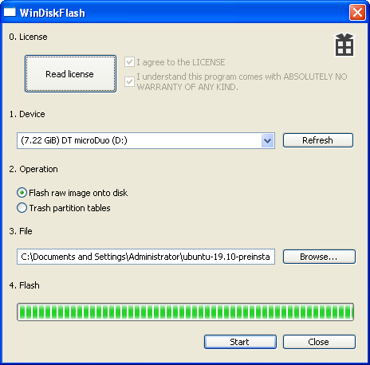

# WinDiskFlash

## About

WinDiskFlash is a tool for easily flashing or creating raw disk images (aka `dd` images) under Windows.

## Features

* Easy usage
* Read disks into images or flash images to disks.
* Safety - ensures correct target device - unlike other tools
* Boot sector / partition table eraser
* Works on Windows XP+ out of the box

## Todo

* Make an icon

## Download

[Latest release](https://github.com/namazso/WinDiskFlash/releases/latest/download/WinDiskFlash.exe)

## Screenshot

## Donations

This software is provided completely free of charge to you, however I spent time and effort developing it. If you like this software, please consider making a donation:

* Bitcoin: 1N6UzYgzn3sLV33hB2iS3FvYLzD1G4CuS2
* Monero: 83sJ6GoeKf1U47vD9Tk6y2MEKJKxPJkECG3Ms7yzVGeiBYg2uYhBAUAZKNDH8VnAPGhwhZeqBnofDPgw9PiVtTgk95k53Rd

## Building

### Requirements

* Visual Studio 2019 (maybe 2017 works too)
* MSVC v141 - VS 2017 C++ build tools
* C++ Windows XP Support for VS 2017 (v141) tools

### Compiling

1. Open WinDiskFlash.sln
2. Build

## Translation

Look into WinDiskFlash/WinDiskFlash.rc, strings in the STRINGTABLE record are needed to be translated. If you have enough development knowledge send a PR, otherwise post an Issue. Thanks for making WinDiskFlash better.

### Translation contributors

**(@bkdwt)[https://github.com/bkdwt]** (*Portuguese (Brazilian)*)

## License

All files are licensed under the following license, unless explicitly stated otherwise in the file:

	Copyright 2020 namazso <admin@namazso.eu>
	WinDiskFlash - Disk image flasher
	
	WinDiskFlash is free software: you can redistribute it and/or modify
	it under the terms of the GNU General Public License as published by
	the Free Software Foundation, either version 3 of the License, or
	(at your option) any later version.
	
	WinDiskFlash is distributed in the hope that it will be useful,
	but WITHOUT ANY WARRANTY; without even the implied warranty of
	MERCHANTABILITY or FITNESS FOR A PARTICULAR PURPOSE.  See the
	GNU General Public License for more details.
	
	You should have received a copy of the GNU General Public License
	along with WinDiskFlash.  If not, see <https://www.gnu.org/licenses/>.